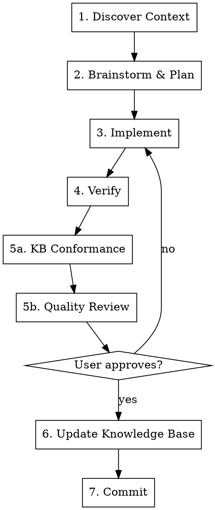

# Sake Task Workflow

Structured task execution that grows the project knowledge base organically.

## When to Use

- Starting any task in the Sake project (feature, bugfix, refactor, docs)
- When you need to ensure consistent quality process
- NOT for answering questions or exploratory conversations

## Workflow

Create a task (TaskCreate) for each numbered step. Mark each as you go.



## Steps

### 1. Discover Context

- Read CLAUDE.md for current project conventions
- Scan available skills (list skill names + descriptions), load relevant ones
- Read files/code related to the task

### 2. Brainstorm & Plan

Invoke `superpowers:brainstorming`, then `superpowers:writing-plans` after design approval.

**Skip if trivial** (typo, single-line fix, mechanical change with obvious solution).

### 3. Implement

Follow the plan. Invoke `superpowers:executing-plans` or work directly.

### 4. Verify

Loop until all pass:

```bash
sake format
sake lint
sake test          # or appropriate subset
```

Fix failures and re-run. Do NOT proceed until green.

### 5a. KB Conformance Check

Re-read CLAUDE.md and relevant skills. Review your diff for:
- Violations of documented patterns/conventions
- Style deviations not caught by automated tools
- Inconsistencies with existing codebase approaches

Fix any issues found, re-run verify if code changed.

### 5b. Quality Code Review

Invoke `superpowers:requesting-code-review`.

Present results to user, request feedback. If changes needed — return to step 3 or 4.

### 6. Update Knowledge Base

**When:** Only after verify passes. If review caused rework, run after subsequent verify.

**Update if** any of these discovered during work:
- Pattern/convention not in CLAUDE.md
- Project knowledge that was hard to find and would be useful again
- Existing CLAUDE.md or skill content became inaccurate
- Domain knowledge or process worth capturing as a new skill

**What to update:**
- **CLAUDE.md** — new patterns, conventions, architectural decisions
- **Existing skills** — corrections, improvements
- **New skills** — reference (domain knowledge) or process (workflows). Use `superpowers:writing-skills`

**Skip if** nothing new was learned.

### 7. Commit

Conventional commit message per project conventions (see CLAUDE.md).

## Red Flags

| Thought | Action |
|---------|--------|
| "This is too simple for the workflow" | Steps 2-3 can be skipped for trivial tasks, but verify + review still apply |
| "I'll update CLAUDE.md later" | Do it now in step 6, before committing. Later = never |
| "Nothing new to capture" | Double-check: did you read any code to understand it? That understanding may be worth capturing |
| "The skill change is too small to test" | If you changed a skill, verify it reads correctly |
